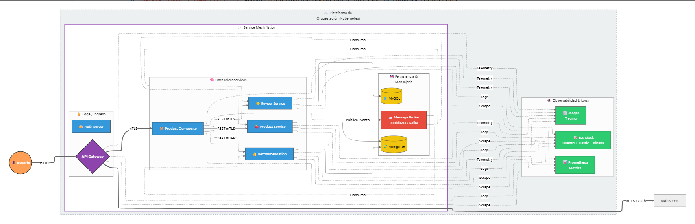

# Sistema de Microservicios con Spring Cloud

## Introducción
Este proyecto es una
 implementación de un sistema backend basado en una arquitectura de microservicios, utilizando el ecosistema de Spring Boot y Spring Cloud. El sistema gestiona un catálogo de productos, permitiendo consultar información agregada de productos, junto con sus reseñas y recomendaciones. Está diseñado para ser resiliente, escalable y observable, listo para ser desplegado
 en entornos contenerizados como Docker y orquestado con Kubernetes.

## Características Principales
*   **Arquitectura de Microservicios:** El sistema se descompone en servicios independientes: `product`, `review`, `recommendation` y un servicio de composición (`product-composite`).
*   **Comunic
ación Asíncrona:** Utiliza colas de mensajes (RabbitMQ y Kafka) para la comunicación entre servicios, promoviendo el desacoplamiento y la resiliencia.
*   **API Gateway:** Un punto de entrada único (`gateway`) para todas las peticiones del cliente, gestionando el enrutamiento y
 la seguridad de manera centralizada.
*   **Seguridad Basada en OAuth2:** Un servidor de autorización (`authorization-server`) centralizado gestiona la autenticación y autorización de clientes y usuarios mediante tokens JWT.
*   **Resiliencia y Tolerancia a Fallos:** Implementación del patrón Circuit
 Breaker con Resilience4j para aislar fallos y evitar su propagación en cascada.
*   **Persistencia Políglota:** Utiliza diferentes bases de datos según las necesidades de cada servicio (MongoDB para productos y recomendaciones, MySQL para reseñas).
*   **Contenerización:** Todo el sistema está completamente
 dockerizado, facilitando el despliegue y la portabilidad con Docker Compose.
*   **Orquestación con Kubernetes:** Incluye manifiestos de Kubernetes y charts de Helm para un despliegue y gestión automatizados en un clúster.
*   **Service Mesh con Istio:** Config
uración para Istio que permite gestionar el tráfico, la seguridad (mTLS) y la observabilidad de manera avanzada.
*   **Observabilidad Completa:**
    *   **Métricas:** Exposición de métricas en formato Prometheus.
    *   **Trazado Distribuido:** Integración
 con Jaeger (Zipkin) para el seguimiento de peticiones a través de los microservicios.
    *   **Logging Centralizado:** Uso del stack EFK (Elasticsearch, Fluentd, Kibana) para la recolección y visualización centralizada de logs.

## Arquitectura del Sistema
El
 sistema sigue un patrón de microservicios clásico. Las peticiones externas llegan al **API Gateway**, que las enruta al servicio de composición (`product-composite-service`). Este, a su vez, se comunica de forma síncrona y asíncrona con los microservicios principales (`product`, `review`, `recommendation`) para agregar la información y responder al cliente. El **Authorization Server** protege los endpoints.

A continuación, un diagrama que ilustra el flujo de comunicación:

## Tecnologías Utilizadas
*   **Backend
:** Java 24, Spring Boot 3.5, Spring Cloud, Spring WebFlux (Project Reactor)
*   **Bases de Datos:** MongoDB, MySQL
*   **Mensajería:** RabbitMQ, Apache Kafka
*   **Seguridad:** Spring Security, OAuth2 / JWT

**Build / Dependencias:** Gradle
*   **Contenerización:** Docker, Docker Compose
*   **Orquestación y Service Mesh:** Kubernetes, Helm, Istio
*   **Observabilidad:**
    *   **Métricas:** Micrometer, Prometheus
    *   **Trazado:** Open
Telemetry, Jaeger (compatible con Zipkin)
    *   **Logging:** Stack EFK (Elasticsearch, Fluentd, Kibana)
*   **Pruebas:** JUnit 5, Mockito

## Documentación de la API
La documentación de la API se genera automáticamente siguiendo la especificación OpenAPI 
3 y está disponible a través de Swagger UI.

Una vez que el sistema esté en ejecución, puedes acceder a la documentación interactiva en la siguiente URL:

*   **Swagger UI:** `https://<HOST>:<PORT>/openapi/swagger-ui.html`

Por ejemplo, al ejecutar con Docker Compose local
mente, la URL sería: `https://localhost:8443/openapi/swagger-ui.html`.

Desde esta interfaz, puedes explorar los endpoints, ver los modelos de datos y probar la API directamente, incluyendo la autenticación OAuth2.